# REKODA V1
## Complete Product, Website, Privacy, Tokenisation and System Architecture

---

# 1. What Rekoda Is

Rekoda is a WhatsApp-first financial operating assistant for small businesses.

It has two product experiences:

## Rekoda Chat

For merchants who manually tell Rekoda what happens in their business through:

- WhatsApp text
- voice notes
- images/documents where supported

Rekoda interprets the merchant's instruction and converts it into structured business records.

Example:

> “Ada bought 3 wigs for ₦150,000. She paid ₦100,000 and will pay the balance Friday.”

Rekoda turns that into:

```text
Sale:                 ₦150,000
Payment received:     ₦100,000
Outstanding:           ₦50,000
Customer:              CUSTOMER_X81
Due:                   Friday
Inventory:             -3 wigs
Invoice:               Generated
Receipt:               Generated for ₦100,000
```

---

## Rekoda Integrate

For merchants already selling through their own WhatsApp Business catalogue.

Their customer:

```text
Browses catalogue
      ↓
Adds products
      ↓
Sends cart/order
      ↓
Makes payment
```

Rekoda automatically handles:

```text
Order capture
      ↓
Customer record
      ↓
Invoice
      ↓
Payment tracking
      ↓
Payment confirmation
      ↓
Receipt
      ↓
Inventory
      ↓
Reconciliation
      ↓
Financial records
```

The merchant does not have to manually tell Rekoda about every digital sale.

---

# 2. The Most Important Product Principle

Rekoda Chat and Rekoda Integrate are **not separate accounting systems**.

They are two different ways business events enter the same Rekoda financial engine.

```text
                   REKODA

       REKODA CHAT        REKODA INTEGRATE
            │                    │
      Human reports         Systems report
      what happened         what happened
            │                    │
            └─────────┬──────────┘
                      ▼
                BUSINESS EVENT
                      ▼
               PRIVACY GATEWAY
                      ▼
             TRANSACTION ENGINE
                      ▼
        FINANCIAL RECORDS / LEDGER
                      ▼
                RECONCILIATION
                      ▼
                FINANCIAL TRUTH
                      ▼
       ┌──────────────┼──────────────┐
       ▼              ▼              ▼
   WhatsApp        Dashboard       Reports
```

---

# 3. Diagram A: Complete Rekoda Connected Architecture

This is the full technical architecture Claude should build toward.

```mermaid
flowchart TB

%% =========================================================
%% SINGLE PUBLIC APPLICATION
%% =========================================================

subgraph HOST["REKODA.APP — ONE DOMAIN / ONE HOSTED APPLICATION"]

    HOME["/ — Marketing Website"]
    CHATPAGE["/chat — Rekoda Chat Marketing"]
    INTEGRATEPAGE["/integrate — Rekoda Integrate Marketing"]
    HOW["/how-it-works"]
    FEATURES["/features"]
    SECURITYPAGE["/security"]
    AIPRIVACYPAGE["/ai-privacy"]
    PRIVACYPAGE["/privacy"]
    TERMSPAGE["/terms"]
    DELETEPAGE["/data-deletion"]

    START["/start — Start Rekoda"]
    VERIFY["/verify — OTP Verification"]
    BUSINESSSETUP["/setup/business"]
    PRODUCTSETUP["/setup/product"]
    WAONBOARD["/setup/whatsapp"]
    CATALOGUESETUP["/setup/catalogue"]
    PAYMENTSETUP["/setup/payments"]
    COMPLETE["/setup/complete"]

    MAGIC["/access/{oneTimeToken}"]

    MERCHANTDASH["/business/* — Merchant Dashboard"]
    ADMINDASH["/admin/* — Rekoda Admin"]

    API["/api/v1/*"]
    TWWEBHOOK["/webhooks/twilio"]
    METAWEBHOOK["/webhooks/meta"]
    PAYSTACKWEBHOOK["/webhooks/paystack"]
end


%% =========================================================
%% PUBLIC JOURNEY
%% =========================================================

HOME --> CHATPAGE
HOME --> INTEGRATEPAGE
HOME --> START

CHATPAGE --> START
INTEGRATEPAGE --> START

START --> VERIFY
VERIFY --> BUSINESSSETUP
BUSINESSSETUP --> PRODUCTSETUP

PRODUCTSETUP -->|"Rekoda Chat"| COMPLETE
PRODUCTSETUP -->|"Integrate / Both"| WAONBOARD

WAONBOARD --> CATALOGUESETUP
CATALOGUESETUP --> PAYMENTSETUP
PAYMENTSETUP --> COMPLETE

COMPLETE --> MERCHANTDASH


%% =========================================================
%% IDENTITY
%% =========================================================

subgraph IDENTITY["PASSWORDLESS IDENTITY & TENANCY"]

    PHONE["Verified Phone Number"]
    OWNER["Business Owner"]
    BUSINESS["Business / Tenant"]
    MEMBER["Business Member"]
    ACCOUNTANT["Accountant / Delegate"]

    MAGICSERVICE["Magic Link Service"]
    OTP["OTP Challenge"]
    SESSION["Secure Authenticated Session"]
    PERMISSIONS["Roles / Permissions"]
end

VERIFY --> PHONE
PHONE --> OWNER
OWNER --> BUSINESS
BUSINESS --> MEMBER

OWNER --> MAGICSERVICE
ACCOUNTANT --> MAGICSERVICE

MAGICSERVICE --> MAGIC
MAGIC -->|"Valid / low risk"| SESSION
MAGIC -->|"Additional verification"| OTP
OTP --> SESSION

SESSION --> PERMISSIONS
PERMISSIONS --> MERCHANTDASH


%% =========================================================
%% REKODA CHAT
%% =========================================================

subgraph CHAT["REKODA CHAT"]

    REKODAWA["Dedicated Rekoda WhatsApp Number"]

    CHATOWNER["Merchant"]
    TEXT["Text Message"]
    VOICE["Voice Note"]
    MEDIA["Receipt / Image / Document"]
end

CHATOWNER --> REKODAWA
REKODAWA --> TEXT
REKODAWA --> VOICE
REKODAWA --> MEDIA


%% =========================================================
%% REKODA INTEGRATE
%% =========================================================

subgraph INTEGRATE["REKODA INTEGRATE"]

    CUSTOMER["Merchant Customer"]

    MERCHANTWA["Merchant WhatsApp Business"]
    WABA["Merchant Meta WABA"]
    TWILIOSUB["Merchant Twilio Subaccount"]
    CATALOGUE["Merchant Catalogue"]

    CART["Customer Cart"]
    ORDER["WhatsApp Order Event"]

    PAYSTACK["Merchant Paystack Connection"]
    PAYMENTEVENT["Paystack Payment Event"]
end

BUSINESS --> WABA
WABA --> TWILIOSUB
BUSINESS --> CATALOGUE
BUSINESS --> PAYSTACK

CUSTOMER --> MERCHANTWA
MERCHANTWA --> CATALOGUE
CATALOGUE --> CART
CART --> ORDER

ORDER --> TWWEBHOOK
PAYSTACK --> PAYMENTEVENT
PAYMENTEVENT --> PAYSTACKWEBHOOK


%% =========================================================
%% WEBHOOK & EVENT INGRESS
%% =========================================================

subgraph INGRESS["SECURE EVENT INGESTION"]

    VERIFYWEBHOOK["Signature Verification"]
    IDEMPOTENCY["Idempotency Check"]
    TENANTRESOLVER["Business / Tenant Resolver"]
    EXTERNALEVENT["External Event Store"]
end

TWWEBHOOK --> VERIFYWEBHOOK
METAWEBHOOK --> VERIFYWEBHOOK
PAYSTACKWEBHOOK --> VERIFYWEBHOOK

TEXT --> TWWEBHOOK
VOICE --> TWWEBHOOK
MEDIA --> TWWEBHOOK

VERIFYWEBHOOK --> IDEMPOTENCY
IDEMPOTENCY --> TENANTRESOLVER
TENANTRESOLVER --> EXTERNALEVENT
TENANTRESOLVER --> BUSINESS


%% =========================================================
%% PRIVACY
%% =========================================================

subgraph PRIVACY["REKODA PRIVACY GATEWAY"]

    PIIDETECT["PII Detection / Classification"]
    IDRESOLVER["Customer Identity Resolver"]
    TOKENIZER["PII Tokenisation"]
    VAULT["Encrypted PII Vault"]
    MINIMIZER["Data Minimisation"]
    AICONTEXT["AI-Safe Context"]
end

EXTERNALEVENT --> PIIDETECT

PIIDETECT --> IDRESOLVER
IDRESOLVER --> VAULT
IDRESOLVER --> TOKENIZER

TOKENIZER --> MINIMIZER
MINIMIZER --> AICONTEXT

VAULT -.->|"CUSTOMER_X81 ↔ real identity"| TOKENIZER


%% =========================================================
%% VOICE PRIVACY PATH
%% =========================================================

subgraph SPEECH["VOICE PROCESSING"]

    AUDIO["Raw Voice Note"]
    STT["Rekoda-Controlled Speech-to-Text"]
    TRANSCRIPT["Raw Transcript"]
    TRANSCRIPTTOKEN["Transcript PII Tokenisation"]
end

VOICE --> AUDIO
AUDIO --> STT
STT --> TRANSCRIPT
TRANSCRIPT --> TRANSCRIPTTOKEN
TRANSCRIPTTOKEN --> TOKENIZER


%% =========================================================
%% AI LAYER
%% =========================================================

subgraph AI["EXTERNAL AI LAYER"]

    UNDERSTAND["Intent Understanding"]
    ENTITY["Business Entity Extraction"]
    COMMAND["StructuredBusinessCommand"]
end

AICONTEXT --> UNDERSTAND
UNDERSTAND --> ENTITY
ENTITY --> COMMAND


%% =========================================================
%% NORMALIZED EVENTS
%% =========================================================

subgraph BUSINESSEVENTS["NORMALIZED BUSINESS EVENTS"]

    EVENT["BusinessEvent"]

    SALE["SaleRequested"]
    PURCHASE["PurchaseRecorded"]
    PAYMENT["PaymentReported"]
    PAYMENTCONFIRMED["PaymentConfirmed"]
    EXPENSE["ExpenseRecorded"]
    ORDERPLACED["OrderPlaced"]
    INVENTORYEVENT["InventoryAdjusted"]
end

COMMAND --> EVENT

ORDER --> EVENT
PAYMENTEVENT --> EVENT

EVENT --> SALE
EVENT --> PURCHASE
EVENT --> PAYMENT
EVENT --> PAYMENTCONFIRMED
EVENT --> EXPENSE
EVENT --> ORDERPLACED
EVENT --> INVENTORYEVENT


%% =========================================================
%% DETERMINISTIC BUSINESS CORE
%% =========================================================

subgraph CORE["REKODA DETERMINISTIC FINANCIAL CORE"]

    VALIDATION["Validation Engine"]
    RULES["Business Rules"]
    MONEY["Money / Calculation Engine"]
    TX["Transaction Engine"]

    CUSTOMERS["Customer Accounts"]
    PRODUCTS["Products"]
    ORDERS["Orders"]
    INVENTORY["Inventory"]
    INVOICES["Invoices"]
    PAYMENTS["Payments"]
    RECEIPTS["Receipts"]
    EXPENSES["Expenses"]
    SUPPLIERS["Suppliers"]
    LEDGER["Financial Ledger"]
    AUDIT["Immutable Audit Events"]
end

SALE --> VALIDATION
PURCHASE --> VALIDATION
PAYMENT --> VALIDATION
PAYMENTCONFIRMED --> VALIDATION
EXPENSE --> VALIDATION
ORDERPLACED --> VALIDATION
INVENTORYEVENT --> VALIDATION

VALIDATION --> RULES
RULES --> MONEY
MONEY --> TX

TX --> CUSTOMERS
TX --> PRODUCTS
TX --> ORDERS
TX --> INVENTORY
TX --> INVOICES
TX --> PAYMENTS
TX --> RECEIPTS
TX --> EXPENSES
TX --> SUPPLIERS
TX --> LEDGER
TX --> AUDIT


%% =========================================================
%% RECONCILIATION
%% =========================================================

subgraph RECON["REKODA RECONCILIATION ENGINE"]

    EXPECTED["Expected Financial Position"]
    OBSERVED["Observed Money Movement"]
    MATCH["Matching Engine"]

    RECONCILED["Reconciled"]
    PARTIAL["Partial Match"]
    UNMATCHED["Unmatched"]
    EXCEPTION["Needs Attention"]
end

ORDERS --> EXPECTED
INVOICES --> EXPECTED
PAYMENTS --> OBSERVED
PAYMENTEVENT --> OBSERVED

EXPECTED --> MATCH
OBSERVED --> MATCH

MATCH --> RECONCILED
MATCH --> PARTIAL
MATCH --> UNMATCHED
MATCH --> EXCEPTION

RECONCILED --> LEDGER
PARTIAL --> AUDIT
UNMATCHED --> AUDIT
EXCEPTION --> AUDIT


%% =========================================================
%% DOCUMENTS / REPORTS
%% =========================================================

subgraph DOCS["DOCUMENT & REPORT ENGINE"]

    DOCGEN["Document Generator"]
    PDF["PDF Generator"]
    EXCEL["Excel Generator"]

    FINREPORT["Financial Reports"]
    SNAPSHOT["Financial Snapshot"]
end

INVOICES --> DOCGEN
RECEIPTS --> DOCGEN

DOCGEN --> PDF

LEDGER --> FINREPORT
RECON --> FINREPORT

FINREPORT --> SNAPSHOT
FINREPORT --> PDF
FINREPORT --> EXCEL


%% =========================================================
%% PII REHYDRATION
%% =========================================================

subgraph OUTPUT["AUTHORIZED OUTPUT LAYER"]

    OUTPUTAUTH["Output Authorization"]
    REHYDRATE["PII Rehydration"]
    RESPONSE["Response Builder"]
end

TX --> RESPONSE
FINREPORT --> RESPONSE

RESPONSE --> OUTPUTAUTH
OUTPUTAUTH --> REHYDRATE
VAULT --> REHYDRATE

REHYDRATE --> REKODAWA
REHYDRATE --> MERCHANTWA
REHYDRATE --> PDF
REHYDRATE --> MERCHANTDASH


%% =========================================================
%% DASHBOARD
%% =========================================================

subgraph DASH["MERCHANT / ACCOUNTANT DASHBOARD"]

    OVERVIEW["Overview / Financial Pulse"]

    TRANSACTIONS["Transactions"]
    SALESORDERS["Sales / Orders"]

    DASHINVOICE["Invoices"]
    DASHRECEIPT["Receipts"]
    DASHPAYMENTS["Payments"]
    DASHEXPENSES["Expenses"]

    DASHCUSTOMERS["Customers"]
    DASHPRODUCTS["Products / Inventory"]

    DASHRECON["Reconciliation"]

    DASHREPORTS["Reports / PDF / Excel"]

    CONNECTIONS["Connections"]
    SETTINGS["Business Settings"]
end

MERCHANTDASH --> OVERVIEW
MERCHANTDASH --> TRANSACTIONS
MERCHANTDASH --> SALESORDERS
MERCHANTDASH --> DASHINVOICE
MERCHANTDASH --> DASHRECEIPT
MERCHANTDASH --> DASHPAYMENTS
MERCHANTDASH --> DASHEXPENSES
MERCHANTDASH --> DASHCUSTOMERS
MERCHANTDASH --> DASHPRODUCTS
MERCHANTDASH --> DASHRECON
MERCHANTDASH --> DASHREPORTS
MERCHANTDASH --> CONNECTIONS
MERCHANTDASH --> SETTINGS

LEDGER --> OVERVIEW
TX --> TRANSACTIONS
ORDERS --> SALESORDERS

INVOICES --> DASHINVOICE
RECEIPTS --> DASHRECEIPT
PAYMENTS --> DASHPAYMENTS
EXPENSES --> DASHEXPENSES

CUSTOMERS --> DASHCUSTOMERS
INVENTORY --> DASHPRODUCTS

RECON --> DASHRECON
FINREPORT --> DASHREPORTS


%% =========================================================
%% ADMIN
%% =========================================================

subgraph ADMIN["REKODA ADMIN CONTROL CENTRE"]

    ADMINHOME["Platform Overview"]
    BUSINESSES["Businesses"]
    ONBOARDING["Integrate Onboarding"]
    HEALTH["Meta / Twilio / Paystack Health"]
    WEBHOOKFAIL["Failed Webhooks"]
    RECONADMIN["Reconciliation Exceptions"]
    TEMPLATES["Document Templates"]
    SUPPORT["Support"]
    ADMINAUDIT["Admin Audit"]
end

ADMINDASH --> ADMINHOME
ADMINDASH --> BUSINESSES
ADMINDASH --> ONBOARDING
ADMINDASH --> HEALTH
ADMINDASH --> WEBHOOKFAIL
ADMINDASH --> RECONADMIN
ADMINDASH --> TEMPLATES
ADMINDASH --> SUPPORT
ADMINDASH --> ADMINAUDIT

BUSINESS --> BUSINESSES
EXTERNALEVENT --> WEBHOOKFAIL
RECON --> RECONADMIN
AUDIT --> ADMINAUDIT
```



---

# 4. Diagram B: Simplified Rekoda Security and Tokenisation Model

This is the simpler architecture to keep in mind while building.

```text
                         REKODA

                    CUSTOMER PII
                         │
                         ▼
              Receive inside Rekoda
                         │
                         ▼
                Detect / classify PII
                         │
                         ▼
                  Encrypt real PII
                         │
                         ▼
              ┌─────────────────────┐
              │ ENCRYPTED PII VAULT │
              │                     │
              │ Ada Okafor          │
              │ +234803...          │
              │ ada@email...        │
              │ Address...          │
              └──────────┬──────────┘
                         │
                         ▼
                    TOKENISE
                         │
                         ▼
                  CUSTOMER_X81
                         │
            ┌────────────┴────────────┐
            │                         │
            ▼                         ▼
    TRANSACTION ENGINE            AI-SAFE DATA
            │                         │
            │                         ▼
            │                    EXTERNAL AI
            │                         │
            │                         ▼
            │              STRUCTURED BUSINESS COMMAND
            │                         │
            └─────────────┬───────────┘
                          ▼
                 VALIDATION ENGINE
                          │
                          ▼
                FINANCIAL TRANSACTION
                          │
         ┌────────────────┼────────────────┐
         ▼                ▼                ▼
      INVOICE          PAYMENT          LEDGER
         │                │                │
         └────────────────┼────────────────┘
                          ▼
                    RECONCILIATION
                          │
                          ▼
                   FINANCIAL TRUTH
                          │
              ┌───────────┼───────────┐
              ▼           ▼           ▼
          WhatsApp     Dashboard    Reports
              │           │           │
              └───────────┼───────────┘
                          ▼
                OUTPUT AUTHORIZATION
                          │
                          ▼
                 REHYDRATE PII ONLY
                   WHERE REQUIRED
                          │
                          ▼
                    Ada Okafor
```

---

# 5. What Tokenisation Means in Rekoda

Tokenisation means replacing identifiable customer information with an opaque identifier.

Example:

```text
Ada Okafor
+2348031234567
ada@example.com
```

becomes:

```text
CUSTOMER_X81
```

`CUSTOMER_X81` tells an external AI nothing about the person's identity.

The relationship:

```text
CUSTOMER_X81
      ↕
Ada Okafor
```

exists only inside Rekoda.

---

# 6. Encryption and Tokenisation Are Used Together

Do not choose one instead of the other.

## Encryption protects the real value.

```text
Ada Okafor
     ↓
Encryption
     ↓
encrypted ciphertext
```

## Tokenisation avoids using the real value unnecessarily.

```text
Ada Okafor
     ↓
CUSTOMER_X81
```

The recommended model is:

```text
Real PII
   │
   ▼
Encrypted in database
   │
   ▼
PII Vault
   │
   ▼
Token reference
   │
   ▼
CUSTOMER_X81
   │
   ├────► Transaction Engine
   │
   ├────► Ledger
   │
   ├────► Reconciliation
   │
   └────► AI-safe context
```

---

# 7. Important Rule: Never Treat a Magic Link as PII Tokenisation

A magic-link token is an **authentication/access token**.

Example:

```text
/access/Lk392kxA...
```

That is different from:

```text
CUSTOMER_X81
```

which is a pseudonymous customer token.

Use different concepts/classes for them.

For example:

```text
CustomerToken
MagicLinkToken
ApiToken
RefreshToken
```

Never mix them.

---

# 8. Rekoda Trust Zones

Claude should understand Rekoda as three security zones.

## Zone 1: Identity Zone

Highest sensitivity.

Contains:

```text
Customer names
Phone numbers
Emails
Addresses
Merchant identity
```

This belongs inside the encrypted PII vault.

---

## Zone 2: Financial Core

Uses stable IDs instead of PII wherever possible.

Example:

```text
BusinessId: bus_182
CustomerId: cus_X81
InvoiceId: inv_901
Amount: 150000
Paid: 100000
Outstanding: 50000
```

This is where:

- transactions
- invoices
- payments
- reconciliation
- inventory
- ledger

operate.

---

## Zone 3: AI Zone

Gets the least information.

For example:

```json
{
  "businessId": "bus_182",
  "customer": "CUSTOMER_X81",
  "intentContext": "sale",
  "items": [
    {
      "product": "wig",
      "quantity": 3,
      "unitPrice": 50000
    }
  ],
  "paymentReported": 100000,
  "currency": "NGN"
}
```

It should not receive:

```text
Ada Okafor
+234803...
Residential address
Customer email
```

unless a particular AI workflow genuinely requires that information and has been deliberately approved.

---

# 9. REKODA CHAT

## Product Definition

Rekoda Chat is a standalone WhatsApp financial assistant.

The merchant talks directly to a dedicated Rekoda WhatsApp number.

The merchant does not need:

- WhatsApp Business integration
- catalogue integration
- Paystack integration to begin
- accounting software
- a password
- accounting knowledge

They can start by simply talking.

---

# 10. Rekoda Chat Target Users

Rekoda Chat is ideal for:

- small retailers
- market vendors
- Instagram vendors
- fashion businesses
- freelancers
- consultants
- restaurants
- pharmacies
- wholesalers
- contractors
- service providers
- businesses accepting physical/cash sales
- businesses receiving ordinary transfers
- businesses that don't use structured online checkout

---

# 11. Rekoda Chat Core Promise

## Talk. Rekoda keeps the records.

The merchant communicates naturally.

Rekoda turns those communications into financial records.

---

# 12. Rekoda Chat User Journey

## Step 1: Discover Rekoda

Merchant visits:

```text
rekoda.app
```

They see:

> Run your business by talking to Rekoda.

CTA:

> Start Rekoda

---

## Step 2: Enter WhatsApp Number

No registration terminology.

No password.

Ask:

> What's your WhatsApp number?

---

## Step 3: OTP

Verify control of the number.

---

## Step 4: Identify Business

Ask:

> What should Rekoda call your business?

Example:

> Ada Fashion

Then:

> What kind of business is it?

That's enough to start.

---

## Step 5: Create Business

Behind the scenes:

```text
Business
BusinessOwner
VerifiedPhone
BusinessMembership
BusinessSettings
```

are created.

---

## Step 6: Send Merchant to WhatsApp

> Ada Fashion is ready.

CTA:

> Open Rekoda on WhatsApp

---

# 13. Rekoda Chat Transaction Journey

Merchant says:

> “Amaka bought 4 bags at ₦28,000 each. She paid ₦80,000.”

---

## Stage 1: Rekoda receives message

```text
WhatsApp
    ↓
Twilio
    ↓
Rekoda webhook
```

---

## Stage 2: Tenant resolution

Rekoda identifies:

```text
Phone
  ↓
BusinessOwner
  ↓
Ada Fashion
```

Everything runs within that business tenant.

---

## Stage 3: Privacy processing

If Amaka already exists:

```text
Amaka
   ↓
Customer resolver
   ↓
CUSTOMER_X92
```

If she is new:

```text
New customer identity
      ↓
PII extraction
      ↓
Encrypted PII vault
      ↓
New CustomerId
      ↓
CUSTOMER_X92
```

The external AI does not need Amaka's identity.

---

## Stage 4: AI understanding

External AI receives something such as:

```text
CUSTOMER_X92 bought 4 bags
at ₦28,000 each.
₦80,000 payment reported.
```

AI returns:

```json
{
  "intent": "RecordSale",
  "customerId": "cus_X92",
  "quantity": 4,
  "unitPrice": 28000,
  "reportedPayment": 80000
}
```

---

## Stage 5: Deterministic calculation

AI does not determine financial truth.

Rekoda calculates:

```text
4 × ₦28,000 = ₦112,000

Sale:          ₦112,000
Payment:        ₦80,000
Outstanding:    ₦32,000
```

---

## Stage 6: Confirmation

Where required:

> I got this:
>
> Amaka  
> 4 bags × ₦28,000  
> Total: ₦112,000  
> Paid: ₦80,000  
> Balance: ₦32,000
>
> Record it?

---

## Stage 7: Posting

Once accepted:

```text
Sale
Customer Account
Payment
Receivable
Invoice
Receipt
Inventory Movement
Ledger Entries
Audit Event
```

are created.

---

## Stage 8: Response

Only now does the output layer rehydrate:

```text
CUSTOMER_X92
      ↓
Amaka
```

for the merchant-facing message.

Rekoda replies:

> Done.
>
> Amaka's sale is ₦112,000.
> ₦80,000 has been recorded as paid.
> ₦32,000 remains outstanding.
>
> Invoice and payment receipt created.

---

# 14. Rekoda Chat Supported Commands

## Sales

> “Sold five shoes for ₦150k.”

---

## Invoice

> “Invoice ABC Ltd ₦450k for software development.”

---

## Payment

> “Ada paid ₦100k.”

---

## Partial Payment

> “Ada paid half.”

---

## Expenses

> “Spent ₦45k on diesel.”

---

## Purchases

> “Bought ₦600k stock from Chima and paid ₦400k.”

---

## Inventory

> “Add 40 black gowns.”

---

## Customers

> “How much does Ada owe?”

---

## Debtors

> “Who owes me?”

---

## Supplier Balances

> “Who am I owing?”

---

## Performance

> “How did we do today?”

---

## Reconciliation

> “Show transactions that haven't matched.”

---

## Reports

> “Send my August sales report.”

---

## Exports

> “Send it as Excel.”

or:

> “Send me a PDF.”

---

# 15. Rekoda Chat Voice Notes

Voice is a major UX advantage.

But privacy is stricter here.

If the merchant says:

> “Ada Okafor paid ₦100k.”

the name exists in the raw recording.

Therefore, if the requirement is:

> External AI providers should not receive customer PII,

the preferred architecture is:

```text
WhatsApp Voice
      ↓
Rekoda
      ↓
Rekoda-controlled Speech-to-Text
      ↓
Transcript
      ↓
PII detection
      ↓
Tokenisation
      ↓
External LLM
```

Not:

```text
WhatsApp voice
      ↓
External transcription service
      ↓
Tokenisation later
```

because the transcription provider would already have processed the identity.

---

# 16. Rekoda Chat Dashboard

The merchant doesn't have to use the dashboard daily.

The dashboard builds itself from conversations.

This is one of Rekoda's strongest promises:

## You run the business. Rekoda builds the records.

Merchant says:

> “Send my dashboard.”

Rekoda creates a secure magic link.

Example flow:

```text
Merchant asks for dashboard
        ↓
Generate one-time access token
        ↓
Send link in trusted WhatsApp conversation
        ↓
Merchant opens link
        ↓
Token validation
        ↓
OTP if required
        ↓
Secure session created
        ↓
Token invalidated/expired
        ↓
Redirect to /business
```

---

# 17. REKODA INTEGRATE

## Product Definition

Rekoda Integrate connects directly to a merchant's WhatsApp commerce activity.

Rekoda Chat captures:

> what the merchant tells Rekoda.

Rekoda Integrate captures:

> what connected business systems tell Rekoda.

---

# 18. Rekoda Integrate Target Users

Ideal for:

- WhatsApp catalogue sellers
- fashion stores
- retailers
- product sellers
- wholesalers
- businesses receiving significant WhatsApp orders

Their customers already shop inside WhatsApp.

Rekoda operates behind the business.

---

# 19. Rekoda Integrate Promise

## Connect your WhatsApp shop. Rekoda handles the money trail.

The customer does not need to know Rekoda exists.

They continue interacting with:

> Ada Fashion

Rekoda runs underneath.

---

# 20. Rekoda Integrate Merchant Onboarding

Merchant visits:

```text
rekoda.app/integrate
```

CTA:

> Connect my WhatsApp Shop

---

## Verify owner

Phone → OTP.

---

## Business setup

Capture:

```text
Trading name
Business category
Business type
Currency
Owner
```

CAC/TIN may be captured when available but should not block an informal merchant from creating a Rekoda business unless a specific downstream provider requires it.

---

## Connect WhatsApp Business

```text
Rekoda
   ↓
Meta onboarding
   ↓
Merchant WhatsApp Business
   ↓
WABA
   ↓
Twilio merchant connection
```

---

## Connect Catalogue

Rekoda creates its internal mappings:

```text
RekodaProductId
      ↕
ExternalCatalogueProductId
```

---

## Connect Paystack

Rekoda connects the merchant's supported payment setup.

---

## Activate

Dashboard shows:

```text
WhatsApp      ✓
Catalogue     ✓
Paystack      ✓

Rekoda Integrate Active
```

---

# 21. Rekoda Integrate Customer Journey

Consider Jennifer shopping from Ada Fashion.

## Stage 1: Browse

Jennifer enters Ada Fashion's WhatsApp catalogue.

---

## Stage 2: Add to Cart

```text
2 × Black Gown
1 × Handbag
```

---

## Stage 3: Submit Order

WhatsApp generates the commerce event.

Rekoda receives:

```text
Business
Customer reference
Products
Quantities
Prices
Currency
Order reference
```

---

## Stage 4: Rekoda Creates Internal Order

```text
External Order
      ↓
BusinessEvent
      ↓
OrderPlaced
      ↓
Rekoda Order
```

---

## Stage 5: Financial Transaction

Rekoda calculates:

```text
2 Black Gowns × ₦40,000 = ₦80,000
1 Handbag × ₦25,000     = ₦25,000

Total                   = ₦105,000
```

Then:

```text
Order
Invoice
Receivable
Inventory reservation
Audit record
```

---

## Stage 6: Payment

Customer receives appropriate payment instruction.

Paystack handles payment.

---

## Stage 7: Payment Event

Paystack sends:

```text
Payment reference
Amount
Currency
Status
Timestamp
```

---

## Stage 8: Verify

Rekoda validates:

```text
Expected:     ₦105,000
Received:     ₦105,000
Currency:     NGN
Reference:    correct
Status:       successful
```

---

## Stage 9: Reconciliation

Rekoda matches:

```text
Customer Order
      ↓
Invoice
      ↓
Payment
      ↓
Receipt
```

If everything agrees:

```text
RECONCILED
```

---

## Stage 10: Complete

Rekoda performs:

```text
Invoice → Paid
Payment → Confirmed
Receivable → ₦0
Receipt → Generated
Inventory → Reduced
Ledger → Updated
Order → Paid
Reconciliation → Complete
```

---

# 22. Partial Payment in Integrate

Example:

```text
Order:          ₦300,000
Deposit:        ₦200,000
Outstanding:    ₦100,000
```

Rekoda must NOT mark the invoice fully paid.

Status:

```text
Order:              CONFIRMED
Invoice:            PARTIALLY_PAID
Payment:            ₦200,000
Receivable:         ₦100,000
Reconciliation:     PARTIAL_MATCH
```

Later:

```text
₦100,000 payment
     ↓
Match
     ↓
Invoice PAID
     ↓
Receivable ₦0
     ↓
Reconciled
```

---

# 23. Integrate Exception Handling

One of Rekoda's strongest differentiators should be that it detects when reality does not match expectations.

Example:

```text
Invoice expected       ₦150,000
Paystack received      ₦130,000
Difference              ₦20,000
```

Do not silently close.

Rekoda produces:

```text
PARTIAL MATCH

Outstanding: ₦20,000
```

Merchant can be notified:

> Order ORD-108 expected ₦150,000.
> ₦130,000 has been confirmed.
>
> ₦20,000 remains outstanding.

---

# 24. Unmatched Payment

If Paystack reports:

```text
₦85,000 received
```

and Rekoda cannot associate it with an invoice:

```text
Payment
   ↓
Matching Engine
   ↓
No Match
   ↓
UNMATCHED
```

Merchant sees:

> Rekoda found a ₦85,000 payment that isn't matched to an order or invoice.

This goes into:

```text
Dashboard → Reconciliation → Needs Attention
```

---

# 25. The Rekoda Financial Truth Loop

This applies to both Chat and Integrate.

```text
            WHAT SHOULD HAPPEN
                   │
             Order / Sale
                   │
                Invoice
                   │
          Expected Payment
                   │
                   ▼
                MATCH
                   ▲
                   │
          Confirmed Payment
                   │
             Money Movement
                   │
             WHAT HAPPENED
```

Result:

```text
Matched
Partial
Unmatched
Exception
```

This is reconciliation.

---

# 26. Why Reconciliation Matters

An invoice says:

> somebody should pay.

A merchant message says:

> somebody says they paid.

A payment provider says:

> money actually moved.

Rekoda connects those three realities.

That is much stronger than merely producing invoices.

---

# 27. Shared Rekoda Dashboard

Both products use the same dashboard.

A business may be:

```text
Chat only
Integrate only
Chat + Integrate
```

but the dashboard doesn't need separate financial records.

Everything appears together.

---

# 28. Dashboard Overview

The dashboard should feel familiar to someone who has seen accounting software but simpler.

Main financial pulse:

```text
Sales this month        ₦3,450,000

Money received          ₦3,010,000

Expenses                ₦1,240,000

Outstanding               ₦440,000

Unreconciled               ₦85,000
```

---

# 29. Dashboard Navigation

```text
OVERVIEW

MONEY
  Transactions
  Payments
  Expenses
  Reconciliation

SALES
  Orders
  Invoices
  Receipts

BUSINESS
  Customers
  Products / Inventory

REPORTS

CONNECTIONS

SETTINGS
```

---

# 30. Dashboard Is Not the Primary Workflow

This is fundamental.

Do not turn Rekoda into:

> another accounting application where users must visit the dashboard constantly.

For most merchants:

```text
WhatsApp = work
Dashboard = visibility
```

Dashboard is primarily for:

- checking
- reviewing
- resolving exceptions
- deeper analysis
- accountants
- exports
- business configuration

---

# 31. Conversational Reporting

Anything important on the dashboard should eventually be queryable from WhatsApp.

Examples:

> “How much did I sell today?”

> “How much did I spend?”

> “Who owes me?”

> “Show unreconciled transactions.”

> “Send my August sales report.”

> “Generate my monthly summary as PDF.”

---

# 32. Reports Must Never Be Generated From AI Maths

This is a hard rule.

Do not do:

```text
Database
   ↓
Send huge dataset to Claude
   ↓
Claude calculates report
```

Instead:

```text
Database
   ↓
Deterministic reporting queries
   ↓
Report model
   ↓
PDF / Excel
```

AI may explain the report conversationally.

AI should not create the underlying numbers.

---

# 33. PDF Financial Snapshot

Example:

```text
ADA FASHION

FINANCIAL SNAPSHOT
August 2026

Sales                  ₦4,250,000
Payments Received      ₦3,900,000
Expenses               ₦1,480,000
Outstanding              ₦350,000
Unreconciled              ₦50,000
```

Generated from stored financial records.

---

# 34. Excel Exports

Support exports for:

```text
Transactions
Sales
Invoices
Payments
Expenses
Customers
Products
Inventory movements
Reconciliation
```

The accountant can download these.

The merchant can request them through WhatsApp.

---

# 35. Accountant Journey

Merchant tells Rekoda:

> “Give my accountant access.”

Rekoda asks for the accountant's phone number if not known.

Create:

```text
BusinessMember

Role = Accountant
```

Permissions:

```text
View Dashboard              YES
View Transactions           YES
View Invoices               YES
View Receipts               YES
View Payments               YES
View Reconciliation         YES
Download Reports            YES

Change Paystack             NO
Change WhatsApp             NO
Change Owner                NO
Delete Transactions         NO
Manage Integrations         NO
```

Send accountant:

```text
One-time Magic Link
```

Never share the owner's magic link.

---

# 36. Magic Link Security

Do not implement:

```text
rekoda.app/business?token=PERMANENT_OWNER_TOKEN
```

Instead:

```text
User requests dashboard
        ↓
Generate random token
        ↓
Hash token server-side
        ↓
Store expiry
        ↓
Send token link
        ↓
User opens
        ↓
Validate hash
        ↓
Check expiry
        ↓
Check usage
        ↓
Optional OTP
        ↓
Create HTTP-only secure session
        ↓
Invalidate token
        ↓
Redirect to /business
```

The URL token should disappear after authentication.

---

# 37. One Website / One Deployment

V1 should remain operationally simple.

Use:

```text
https://rekoda.app
```

for everything.

Public:

```text
/
 /chat
 /integrate
 /features
 /how-it-works
 /security
 /ai-privacy
 /privacy
 /terms
 /data-deletion
```

Onboarding:

```text
/start
/verify
/setup/*
```

Access:

```text
/access/{token}
```

Merchant:

```text
/business/*
```

Admin:

```text
/admin/*
```

API:

```text
/api/v1/*
```

Webhooks:

```text
/webhooks/twilio
/webhooks/meta
/webhooks/paystack
```

One deployment does not mean one architectural blob.

Use a modular monolith.

---

# 38. Suggested Module Structure

```text
Rekoda

├── Identity
│   ├── OTP
│   ├── MagicLinks
│   ├── Sessions
│   └── Permissions
│
├── Tenancy
│   ├── Businesses
│   ├── BusinessUsers
│   └── BusinessConnections
│
├── Privacy
│   ├── PiiDetection
│   ├── PiiVault
│   ├── Tokenisation
│   ├── DataMinimisation
│   └── Rehydration
│
├── RekodaChat
│   ├── Conversations
│   ├── Text
│   ├── Voice
│   └── Media
│
├── RekodaIntegrate
│   ├── Meta
│   ├── Twilio
│   ├── Catalogues
│   └── CommerceEvents
│
├── Customers
├── Products
├── Inventory
├── Orders
├── Sales
├── Purchases
├── Suppliers
├── Expenses
│
├── Invoices
├── Receipts
├── Payments
│
├── Transactions
├── Ledger
├── Reconciliation
│
├── Documents
├── Reports
├── Exports
│
├── Integrations
│   ├── Twilio
│   ├── Meta
│   └── Paystack
│
├── Audit
│
├── MerchantDashboard
└── Admin
```

---

# 39. Core Domain Model

At minimum:

```text
Business
BusinessUser
BusinessMembership
BusinessConnection

Customer
CustomerIdentity

Product
InventoryItem
InventoryMovement

Order
OrderItem

Sale
Purchase
Expense

Invoice
InvoiceItem

Payment
PaymentAllocation

Receipt

Supplier

LedgerAccount
LedgerEntry

Reconciliation
ReconciliationMatch

Conversation
ConversationMessage

ExternalEvent

Document

Report

MagicLink
Session

AuditEvent
```

---

# 40. Tenant Isolation

Every business-owned record must carry:

```text
BusinessId
```

Examples:

```text
Customer.BusinessId
Invoice.BusinessId
Payment.BusinessId
Product.BusinessId
Order.BusinessId
Expense.BusinessId
LedgerEntry.BusinessId
```

Do not rely only on IDs supplied by the UI.

Every query should be tenant-scoped.

---

# 41. Source Tracking

Every financial record should remember how it entered Rekoda.

For example:

```text
SourceType

REKODA_CHAT
WHATSAPP_CATALOGUE
PAYSTACK_WEBHOOK
ADMIN
SYSTEM
```

Example:

```text
Transaction

SourceType = REKODA_CHAT
SourceId = conversationMessage_182
```

or:

```text
Order

SourceType = WHATSAPP_CATALOGUE
SourceId = externalOrder_928
```

This creates traceability.

---

# 42. Audit History

Important financial records should never silently mutate.

Record:

```text
Who
BusinessId
Entity
EntityId
Action
OldValue
NewValue
Timestamp
Source
Reason
```

Example:

```text
Invoice INV-104

Amount changed:
₦150,000 → ₦180,000

Source:
WhatsApp correction

Actor:
Business Owner
```

---

# 43. AI Responsibilities

External AI may:

```text
Understand natural language
Detect business intent
Extract quantities
Extract reported amounts
Resolve conversational meaning
Classify user requests
Generate conversational wording
```

External AI must NOT be responsible for:

```text
Calculating authoritative balances
Posting ledger entries directly
Marking payments reconciled
Determining payment success
Generating authoritative financial totals
Changing transactions without validation
```

---

# 44. Transaction Engine Responsibilities

The deterministic Rekoda core owns:

```text
Money calculations
Invoice totals
Payment allocations
Outstanding balances
Inventory movements
Tax rules
Transaction state
Ledger entries
Reconciliation
Document source data
Report data
```

---

# 45. Example Shared Flow

Merchant tells Rekoda Chat:

> “Ada paid ₦100k.”

and Paystack later independently reports:

```text
₦100,000 received
```

The result should be:

```text
Merchant Report
      │
      ▼
PaymentReported
      │
      ▼
Expected/Reported Payment
      │

      │          Paystack
      │             │
      │             ▼
      │      PaymentConfirmed
      │             │
      └──────┬──────┘
             ▼
       Reconciliation
             │
             ▼
         MATCHED
             │
             ▼
        Financial Truth
```

---

# 46. Automatic Integrate Flow

```text
CUSTOMER
   │
   ▼
WHATSAPP CATALOGUE
   │
   ▼
CART
   │
   ▼
ORDER
   │
   ▼
REKODA BUSINESS EVENT
   │
   ▼
ORDER CREATED
   │
   ▼
INVOICE CREATED
   │
   ▼
PAYSTACK PAYMENT REQUEST
   │
   ▼
CUSTOMER PAYS
   │
   ▼
PAYSTACK WEBHOOK
   │
   ▼
PAYMENT VERIFIED
   │
   ▼
MATCH PAYMENT TO INVOICE
   │
   ▼
RECONCILE
   │
   ▼
RECEIPT
   │
   ▼
INVENTORY UPDATE
   │
   ▼
LEDGER UPDATE
   │
   ▼
DASHBOARD UPDATE
   │
   ▼
MERCHANT NOTIFICATION
```

---

# 47. Manual Chat Flow

```text
MERCHANT
   │
   ▼
VOICE / TEXT
   │
   ▼
REKODA
   │
   ▼
PRIVACY GATEWAY
   │
   ▼
TOKENISE PII
   │
   ▼
AI UNDERSTANDING
   │
   ▼
STRUCTURED COMMAND
   │
   ▼
VALIDATION
   │
   ▼
CONFIRM IF REQUIRED
   │
   ▼
TRANSACTION ENGINE
   │
   ▼
FINANCIAL RECORDS
   │
   ▼
RECONCILIATION
   │
   ▼
DASHBOARD / CHAT / REPORT
```

---

# 48. Why the Two Products Belong Together

Rekoda Chat captures what digital systems cannot automatically see.

Examples:

```text
Cash sale
Physical store sale
Offline expense
Supplier delivery
Customer credit
Cash payment
Informal purchase
```

Rekoda Integrate captures what connected systems can see.

Examples:

```text
WhatsApp catalogue order
Digital cart
Paystack payment
Payment confirmation
Online inventory movement
```

Together:

```text
MANUAL BUSINESS REALITY
          +
DIGITAL BUSINESS REALITY
          │
          ▼
       REKODA
          │
          ▼
COMPLETE BUSINESS RECORD
```

---

# 49. Product Benefits

## For Business Owners

Rekoda reduces:

- manual bookkeeping
- forgotten transactions
- forgotten debts
- spreadsheet dependence
- invoice preparation
- receipt preparation
- uncertainty about payments
- difficulty understanding financial position

---

## For Accountants

Rekoda provides:

- structured transaction history
- invoices
- receipts
- payments
- expenses
- customer balances
- reconciliation
- PDF reports
- Excel exports
- audit history

instead of receiving a bag of receipts at month-end.

---

## For WhatsApp Sellers

Integrate provides:

- automatic order capture
- automatic invoice generation
- payment verification
- automatic receipts
- automatic inventory changes
- reconciliation
- financial records without re-entry

---

# 50. Rekoda's Central Product Promise

Rekoda should not be presented primarily as:

> AI receipt generator.

Nor simply:

> WhatsApp accounting.

The larger promise is:

# Run your business. Rekoda keeps the money trail right.

Or:

# You run the business. Rekoda builds the records.

---

# 51. The Core Rekoda Loop

Everything should ultimately support:

```text
CAPTURE
   ↓
UNDERSTAND
   ↓
RECORD
   ↓
TRACK
   ↓
COLLECT
   ↓
MATCH
   ↓
RECONCILE
   ↓
KNOW
   ↓
ACT
```

### Capture

Voice, chat, catalogue, payment event.

### Understand

What business action happened?

### Record

Create correct structured records.

### Track

Customers, inventory, balances, suppliers.

### Collect

Invoices and payments.

### Match

Connect money to the correct transaction.

### Reconcile

Establish whether the financial state agrees.

### Know

Reports, dashboard and questions.

### Act

Remind customers, resolve exceptions, send documents.

---

# 52. V1 Boundaries

Build now:

```text
Rekoda Chat
Rekoda Integrate
WhatsApp
Meta catalogue
Twilio
Paystack
Voice notes
Text chat
Invoices
Receipts
Customers
Products
Inventory
Payments
Expenses
Suppliers
Ledger
Reconciliation
Financial reporting
PDF
Excel
Magic-link dashboard
Accountant access
Admin control centre
Privacy/tokenisation
```

Do NOT build yet:

```text
QuickBooks
Xero
Instagram
TikTok
Shopify
Facebook commerce integrations
Payroll
Loans
Tokenised assets
Crypto
Full ERP
Mobile application
Public API marketplace
```

---

# 53. Non-Negotiable Build Rules for Claude/Fable 5

1. **Rekoda Chat and Rekoda Integrate must use the same financial core.**

2. **All business-owned data must be tenant-scoped by `BusinessId`.**

3. **Customer PII must be separated from general financial records.**

4. **PII must be encrypted at rest.**

5. **External AI should receive tokenised customer identifiers by default.**

6. **AI should receive the minimum context necessary.**

7. **AI never posts authoritative financial records directly.**

8. **AI returns a structured command.**

9. **Deterministic Rekoda code validates the command.**

10. **Deterministic Rekoda code calculates all monetary values.**

11. **Payment confirmation and payment reconciliation are separate concepts.**

12. **A receipt should represent a real recorded payment, not simply an invoice marked paid by AI.**

13. **Invoices and receipts are generated from stored transaction data.**

14. **Reports are generated from stored financial records, not AI calculations.**

15. **Magic links must be short-lived/revocable and exchanged for secure sessions.**

16. **Accountants have separate delegated access.**

17. **Webhooks must be signature-verified.**

18. **Webhook processing must be idempotent.**

19. **Important financial changes must create audit events.**

20. **Tokenisation should occur in a shared Privacy Gateway.**

21. **PII rehydration should occur only in an authorised output path.**

22. **External event payloads should be retained appropriately for traceability without unnecessarily duplicating PII.**

23. **Dashboard and Rekoda Chat must read from the same financial records.**

24. **A business using both Chat and Integrate must see one consolidated financial position.**

25. **One domain and one deployment are acceptable for V1, but modules must remain logically separated.**

---

# 54. The Final Mental Model

When there is uncertainty during implementation, come back to this:

```text
                         REKODA

                 SOMETHING HAPPENS
                        │
         ┌──────────────┴───────────────┐
         │                              │
     HUMAN SAYS IT                SYSTEM SEES IT
         │                              │
    Rekoda Chat                 Rekoda Integrate
         │                              │
         └──────────────┬───────────────┘
                        ▼
                  BUSINESS EVENT
                        │
                        ▼
                 PRIVACY GATEWAY
                        │
               ┌────────┴────────┐
               │                 │
          REAL IDENTITY      SAFE CONTEXT
               │                 │
           PII VAULT          EXTERNAL AI
               │                 │
               └────────┬────────┘
                        ▼
                STRUCTURED COMMAND
                        │
                        ▼
                BUSINESS VALIDATION
                        │
                        ▼
                 TRANSACTION ENGINE
                        │
          ┌─────────────┼─────────────┐
          ▼             ▼             ▼
       RECORDS       DOCUMENTS       LEDGER
          │             │             │
          └─────────────┼─────────────┘
                        ▼
                  RECONCILIATION
                        │
                        ▼
                   FINANCIAL TRUTH
                        │
         ┌──────────────┼──────────────┐
         ▼              ▼              ▼
      WHATSAPP       DASHBOARD      PDF / EXCEL
         │
         ▼
   BUSINESS OWNER

```

# Rekoda in One Sentence

**Rekoda captures business activity through conversation or connected WhatsApp commerce, protects customer identity, converts events into structured financial records, tracks the movement of money, reconciles what should have happened against what actually happened, and makes the resulting financial truth available through WhatsApp, dashboards, invoices, receipts, PDF reports and Excel exports.**